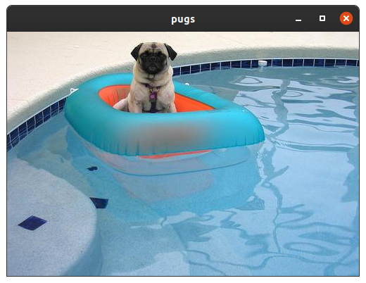

# pugs

> View pugs, quickly and easily.



pugs pull an image from [dog api](https://dog.ceo/dog-api/) and displays it on every click.

## Install

Install GLUT, libcurl, libjpeg.

```
# On Ubuntu, this is as easy as
sudo apt-get install mesa-utils freeglut3-dev libcurl4-openssl-dev libjpeg-dev
```

```
make
sudo make install
```

```
$ pugs
```
